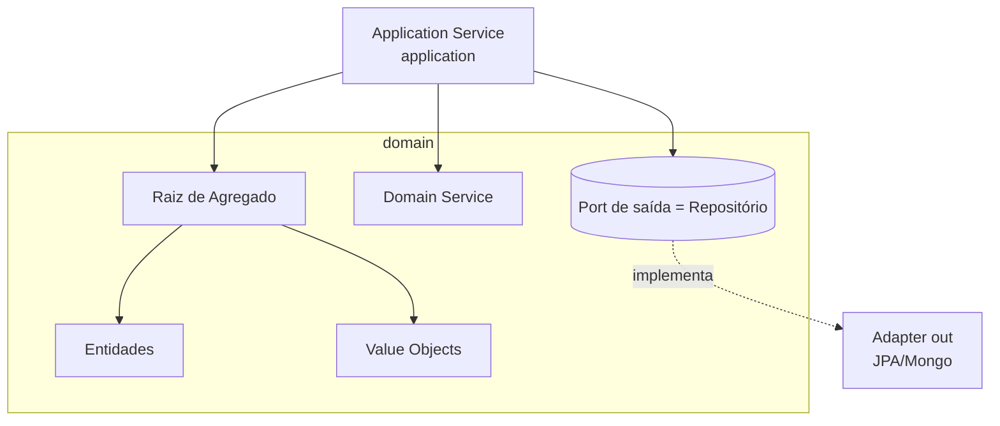

# Domain-Driven Design (DDD)

Guia para modelagem de domínio no projeto `orch-poc`, complementar à Arquitetura
Hexagonal. Comunicação e documentação em **Português (Brasil)**.

## DDD Tático

- **Entidade**: identidade própria e ciclo de vida; igualdade por id, não por
  atributos. Mora em `domain/entity`.
- **Value Object**: imutável, sem identidade; igualdade por valor (ex.: dinheiro,
  documento, status). Prefira `record` em Java.
- **Agregado**: cluster de entidades/VOs com uma **raiz de agregado** que
  garante invariantes. Referencie outros agregados por id, não por objeto.
- **Repositório**: abstração de persistência da raiz de agregado. Modelado como
  **port de saída** (`domain/port/out`), implementado em `adapter/out`.
- **Domain Service**: regra de negócio que não pertence naturalmente a uma
  entidade/VO. Fica no domínio, sem dependências de framework.
- **Application Service**: orquestra casos de uso, transações e coordenação
  entre agregados. Mora em `application` e implementa ports de entrada.
- **Domain Event**: fato relevante do negócio ocorrido (nome no passado, ex.:
  `PedidoOrquestrado`). Útil para desacoplar efeitos colaterais.

## DDD Estratégico

- **Linguagem Ubíqua**: use os termos do negócio no código, nas interfaces e nos
  ADRs. Evite jargão técnico onde o negócio tem um nome próprio.
- **Bounded Context**: fronteira explícita de um modelo. Um termo pode ter
  significados diferentes em contextos distintos.
- **Context Mapping**: relacione contextos (Partnership, Customer/Supplier,
  Conformist, Anticorruption Layer, Shared Kernel, Open Host Service).
  Numa integração externa, prefira **Anticorruption Layer** no `adapter/out`
  para proteger o modelo interno.

## Como aplicar no hexagonal

## Checklist de modelagem

- [ ] Invariantes garantidas pela raiz de agregado, não espalhadas.
- [ ] Value Objects imutáveis para conceitos sem identidade.
- [ ] Repositórios operam por raiz de agregado, expostos como ports de saída.
- [ ] Linguagem ubíqua refletida em nomes de classes/métodos.
- [ ] Anticorruption Layer nas integrações externas.
- [ ] Sem lógica de negócio vazando para controllers ou adapters.

## Anti-padrões a sinalizar

- **Anemic Domain Model**: entidades só com getters/setters e regra no service.
- Agregados gigantes que carregam grafos inteiros de objetos.
- Referência direta entre raízes de agregado (deveria ser por id).
- Regras de negócio implementadas em `adapter/*` ou em `config`.

## Postura

- Adeque o rigor ao estágio de POC: nem todo módulo precisa de agregados
  elaborados. Recomende DDD tático onde há complexidade de negócio real e
  simplifique onde for CRUD puro. Sempre justifique o trade-off.
