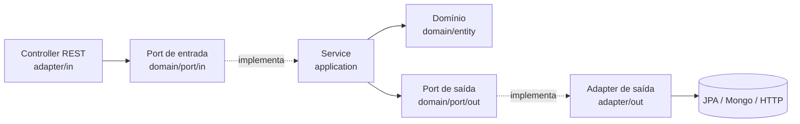

# Arquitetura Hexagonal (Ports & Adapters)

Guia prático para aplicar e revisar Arquitetura Hexagonal no projeto `orch-poc`.
Toda a comunicação e documentação é em **Português (Brasil)**.

## Layout de pacotes esperado

```
com.bradesco.orch
├── adapter
│   ├── in        # Adaptadores de entrada: controllers REST, listeners, schedulers
│   └── out       # Adaptadores de saída: repositórios JPA/Mongo, HTTP clients
├── application   # Serviços de aplicação / casos de uso (implementam ports/in)
├── config        # Configuração de infraestrutura e beans do Spring
└── domain
    ├── entity    # Entidades e modelos de domínio (regras de negócio puras)
    └── port
        ├── in    # Portas de entrada: interfaces dos casos de uso
        └── out   # Portas de saída: interfaces de persistência/integração
```

## Regras invioláveis

1. **Direção das dependências**: sempre aponta para o domínio.
   `adapter/*` → `application` → `domain`. O domínio **nunca** importa
   `adapter/*`, Spring, JPA, Mongo, RestClient ou tipos Azure.
2. **Ports de entrada (`domain/port/in`)**: interfaces que descrevem casos de
   uso. Implementadas por serviços em `application`.
3. **Ports de saída (`domain/port/out`)**: interfaces para persistência e
   integrações externas. Implementadas por classes em `adapter/out`.
4. **Adapters de entrada (`adapter/in`)**: controllers/listeners chamam apenas
   ports de entrada. Nunca acessam `adapter/out` diretamente.
5. **Domínio puro**: entidades em `domain/entity` livres de anotações de
   framework. Se persistência exigir `@Entity`, crie um modelo de persistência
   separado em `adapter/out` e faça mapeamento explícito (mapper dedicado).

## Fluxo de uma requisição (referência)



## Checklist de revisão

- [ ] Nenhum import de framework em `domain/*`.
- [ ] Casos de uso expostos por interface em `domain/port/in`.
- [ ] Integrações externas atrás de interface em `domain/port/out`.
- [ ] Controllers dependem só de ports de entrada.
- [ ] Modelos de persistência separados das entidades de domínio.
- [ ] Mapeamento domínio ↔ persistência explícito e testável.
- [ ] Beans e wiring do Spring confinados a `config` e adapters.

## Anti-padrões a sinalizar

- Entidade de domínio anotada com `@Entity`/`@Document` e reutilizada como
  modelo de persistência.
- Serviço de aplicação injetando repositório concreto em vez do port de saída.
- Controller chamando repositório/HTTP client diretamente.
- Vazamento de tipos de infraestrutura (ex.: `ResponseEntity`, `Pageable` JPA)
  para dentro do domínio.

## Postura

- Numa POC, priorize simplicidade: aponte quando uma separação extra é overkill,
  mas nunca à custa de violar a direção das dependências.
- Ao sugerir mudanças, justifique com trade-offs e proponha a correção mínima.
