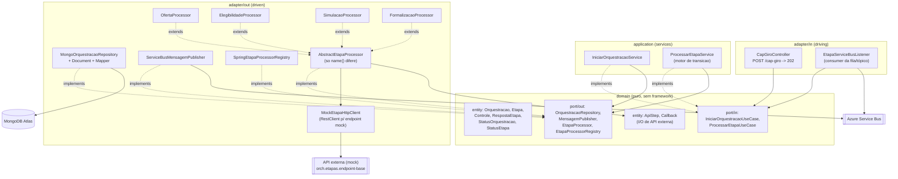
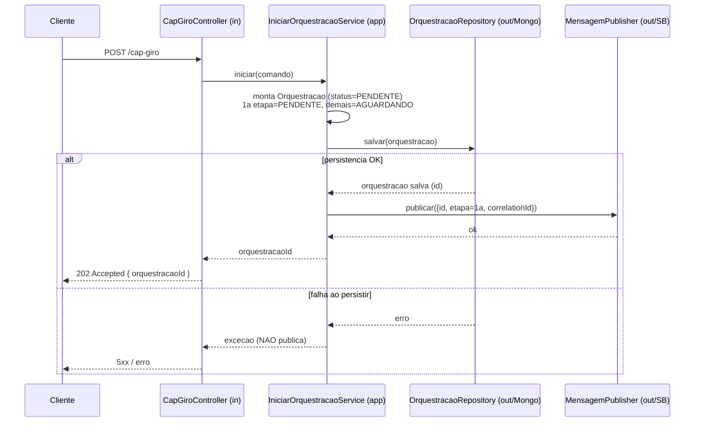
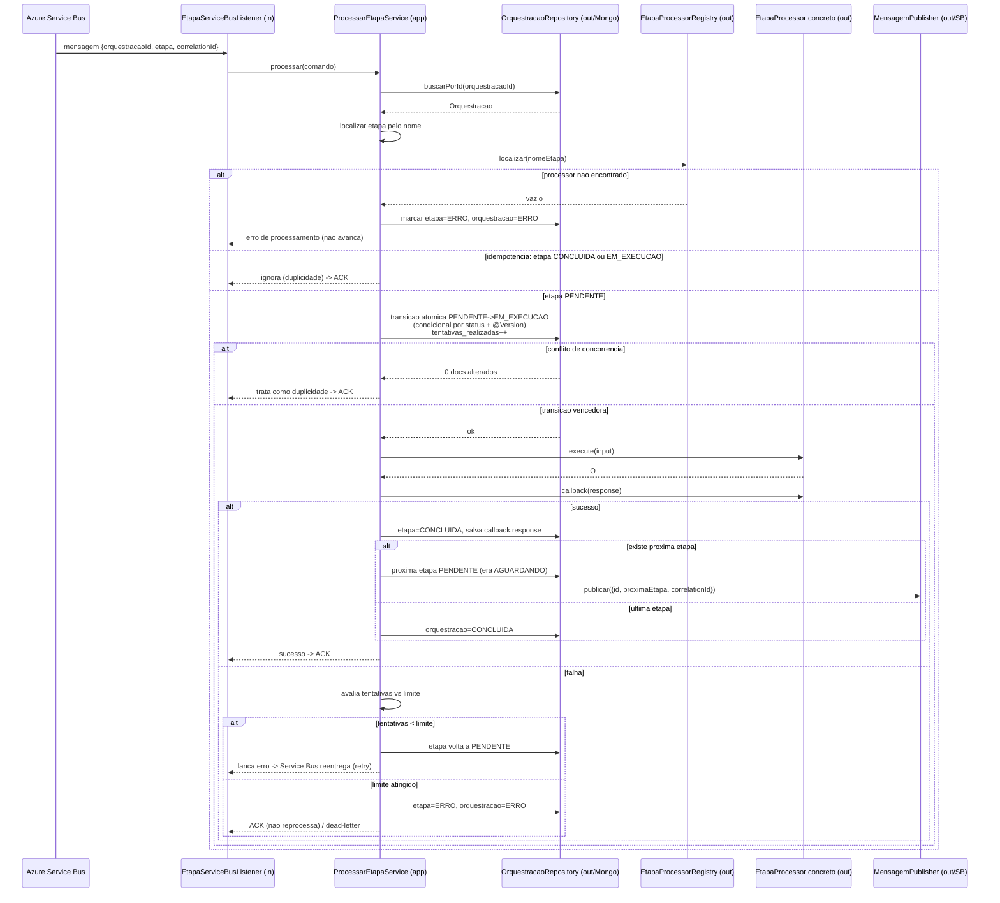
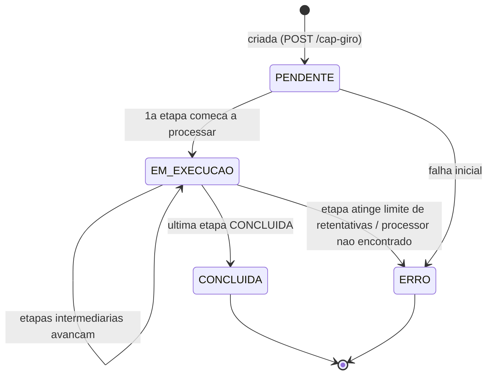
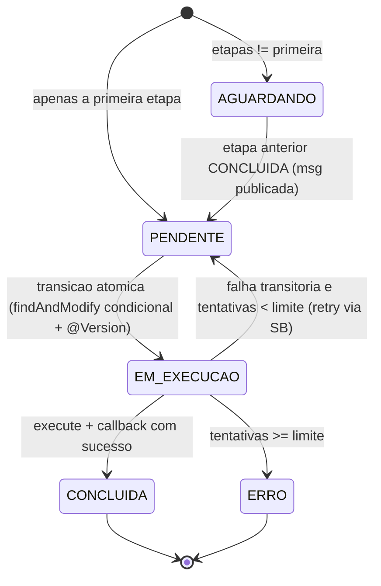

# Design — Orquestrador de APIs baseado em etapas e Service Bus

## 1. Overview

Esta feature implementa um orquestrador **assíncrono e orientado a eventos**, no qual uma orquestração (`baas:cap-giro`) é composta por uma sequência ordenada de etapas. A execução **transita obrigatoriamente pelo Azure Service Bus** entre etapas: nenhuma etapa chama a próxima diretamente e nenhum loop síncrono percorre o fluxo inteiro. O **MongoDB (cluster Atlas) é a fonte da verdade** do estado (máquina de estados da orquestração e de cada etapa), enquanto o Service Bus transporta apenas comandos leves (`orquestracaoId`, `etapa`, `correlationId`).

A orquestração de referência `baas:cap-giro` é composta por **exatamente 4 etapas concretas, em ordem fixa** (Req. 11):

| Ordem | Etapa (constante) | Nome canônico (`name()`) |
|---|---|---|
| 0 | OFERTA | `baas:etapa:cap-giro:oferta` |
| 1 | ELEGIBILIDADE | `baas:etapa:cap-giro:elegibilidade` |
| 2 | SIMULACAO | `baas:etapa:cap-giro:simulacao` |
| 3 | FORMALIZACAO | `baas:etapa:cap-giro:formalizacao` |

Ao executar, **cada etapa aciona uma API externa (mock)** via `POST`. Nesta POC as 4 etapas usam o **mesmo endpoint** compartilhado — `POST https://free.mockerapi.com/mock/141caf88-d77d-4ac5-b2d1-1a232d7e3d09` — com o contrato de request/response `{ "id": "<uuid>" }`. O endpoint é **externalizado** via a propriedade `orch.etapas.endpoint-base` (default o mock acima) e o resultado retornado (`EtapaResponse`) é persistido em `etapas[].callback.response` (Req. 3, 11). A connection string do MongoDB é **externalizada** via `MONGODB_URI`, sem credenciais hardcoded no código (Req. 12).

Principais características:

- **Desacoplamento total entre etapas** — cada etapa é uma unidade de trabalho isolada, acionada por mensagem, o que habilita retry, retomada, escalabilidade horizontal e recuperação após falha (Req. 4, 9).
- **Estado durável** — o documento de orquestração no MongoDB carrega status, controle de tentativas e o resultado (`callback.response`) de cada etapa (Req. 1, 3).
- **Exactly-once efetivo** — idempotência garantida por verificação de estado + transição atômica condicional `PENDENTE -> EM_EXECUCAO` com optimistic locking (Req. 7, 8).
- **Arquitetura hexagonal estrita** — o domínio não conhece Spring, Mongo nem Azure. Infraestrutura vive apenas nos adapters (Req. 9, 10).

Stack: **Java 21 + Spring Boot 4.0.x + Maven**, pacote base `com.bradesco.orch`. Persistência via **Spring Data MongoDB**; mensageria via **Spring Cloud Azure (Azure Service Bus)**; chamadas a APIs externas via **RestClient**. Deploy em **Azure Container Apps** (escala horizontal 0..N réplicas — o que reforça a exigência de idempotência e concorrência).

### Reconciliação da porta dos processors — decisão de design

O `requirements.md` descreve uma interface `EtapaProcessor<I,O>` com `name()` / `execute(input)` / `callback(response)`. O código real do projeto já possui:

```java
// com.bradesco.orch.domain.entity
public interface ApiStep<I, O> { O execute(I input, Callback<O> callback); }
public interface Callback<T> { void onSuccess(T response); void onError(Exception error); }
```

**Decisão:** introduzir `EtapaProcessor<I, O>` como a **porta de saída de domínio dos processors** (`domain/port/out`), pois é essa interface que o motor de orquestração conhece e que o registry indexa por `name()`. Justificativa hexagonal: o motor precisa localizar um processor **por nome** (Req. 2.3, 10) e invocar `execute` + `callback` como um contrato coeso; a assinatura de `EtapaProcessor` expressa exatamente isso e é a que o requisito 10.4 exige.

Tratamento explícito dos artefatos existentes:

- **`ApiStep<I,O>` — reaproveitado/adaptado, não descartado.** `ApiStep` modela a mecânica de uma **chamada a API externa** com callback de sucesso/erro (`execute(input, callback)`). Ele passa a ser um **detalhe interno de implementação** de cada processor concreto: o processor concreto (adapter/out) usa `ApiStep` + `RestClient` para invocar o BaaS e reage via `Callback`. Ou seja, `ApiStep`/`Callback` continuam vivos como abstração de I/O de API, enquanto `EtapaProcessor` é a porta que o domínio enxerga.
- **`Callback<T>` (interface funcional de sucesso/erro) — reaproveitado** dentro dos processors concretos para tratar a resposta do `ApiStep`. Note que há dois conceitos distintos com o mesmo nome: a **interface `Callback<T>`** (mecanismo de I/O) e o **sub-documento `callback.response`** (estado persistido). O design mantém ambos e os nomeia distintamente para evitar confusão (ver Data Models). A operação `callback(response)` de `EtapaProcessor` é a que produz o objeto persistido em `etapas[].callback.response`.

Resumo da relação:

```
EtapaProcessor<I,O>  (domain/port/out)  -> porta que o motor conhece; indexada por name()
      |  implementada por
      v
AbstractEtapaProcessor  (adapter/out)   -> concentra execute/callback comuns
      |  estendida por (so name() difere)
      v
OfertaProcessor / ElegibilidadeProcessor / SimulacaoProcessor / FormalizacaoProcessor
      |  delegam a
      v
MockEtapaHttpClient (RestClient p/ orch.etapas.endpoint-base)
      |  reutiliza internamente
      v
ApiStep<I,O> + Callback<O>  -> detalhe de chamada à API externa (mock)
```

---

## 2. Architecture

### 2.1 Visão hexagonal (Ports & Adapters)



Regra de dependência: setas de código apontam **para dentro**. `application` depende de `domain/port`; adapters implementam as ports; o `domain` não importa nada de Spring/Mongo/Azure (Req. 9).

### 2.2 Fluxo de inicialização (Req. 1)



Observação: persistir **antes** de publicar garante que nunca haverá mensagem apontando para orquestração inexistente (Req. 1.6, 9.2).

### 2.3 Fluxo de processamento de uma etapa (Req. 2..8)



### 2.4 Máquina de estados

Orquestração (Req. 1.2, 5.2, 6.4):



Etapa (Req. 4, 6, 7, 8):



---

## 3. Components and Interfaces

A seguir, os componentes por camada hexagonal, com pacote e responsabilidade. Assinaturas são ilustrativas.

### 3.1 `adapter/in` (driving)

**`CapGiroController`** — `com.bradesco.orch.adapter.in.rest` — Req. 1, 9.3
- `POST /cap-giro` recebe o request, delega ao `IniciarOrquestracaoUseCase`, responde `202 Accepted` com `{ orquestracaoId }`. Não aguarda etapas.
```java
@RestController
@RequestMapping("/cap-giro")
class CapGiroController {
    private final IniciarOrquestracaoUseCase iniciar;
    @PostMapping
    ResponseEntity<IniciarOrquestracaoResponse> iniciar(@RequestBody IniciarOrquestracaoRequest req) {
        var id = iniciar.iniciar(req.toComando());
        return ResponseEntity.accepted().body(new IniciarOrquestracaoResponse(id));
    }
}
```

**`EtapaServiceBusListener`** — `com.bradesco.orch.adapter.in.messaging` — Req. 2, 6.5, 7, 9.4
- Consumer do Azure Service Bus. Desserializa a `MensagemEtapa`, monta o comando e delega ao `ProcessarEtapaUseCase`. Faz o mapeamento entre resultado do use case e ACK/abandon/dead-letter (ver Error Handling).
```java
@Component
class EtapaServiceBusListener {
    private final ProcessarEtapaUseCase processar;
    // @ServiceBusListener(destination = "${orch.sb.fila-etapas}") — via Spring Cloud Azure
    void onMessage(MensagemEtapa msg) { processar.processar(msg.toComando()); }
}
```

### 3.2 `domain/port/in` (use cases)

`com.bradesco.orch.domain.port.in`
```java
public interface IniciarOrquestracaoUseCase {
    String iniciar(IniciarOrquestracaoComando comando); // retorna orquestracaoId
}

public interface ProcessarEtapaUseCase {
    ResultadoProcessamento processar(ProcessarEtapaComando comando);
}
```
`ResultadoProcessamento` é um enum/objeto de domínio (`SUCESSO`, `DUPLICIDADE`, `RETENTAR`, `ERRO_FINAL`, `PROCESSOR_NAO_ENCONTRADO`) usado pelo listener para decidir ACK vs retry vs dead-letter — mantém o domínio livre de tipos do Service Bus (Req. 9).

### 3.3 `domain/port/out` (ports)

`com.bradesco.orch.domain.port.out`
```java
public interface OrquestracaoRepository {
    Orquestracao salvar(Orquestracao orquestracao);
    Optional<Orquestracao> buscarPorId(String id);
    // transicao atomica condicional: so altera se etapa estiver PENDENTE; usa @Version
    boolean transicionarEtapaParaEmExecucao(String orquestracaoId, String etapa);
    void atualizar(Orquestracao orquestracao); // persiste estado/callback/tentativas (optimistic lock)
}

public interface MensagemPublisher {
    void publicar(MensagemEtapa mensagem); // Req. 4.3, 4.4, 9.1, 9.3
}

public interface EtapaProcessor<I, O> {   // porta dos processors (ver secao 1)
    String name();
    O execute(I input);
    void callback(O response);
}

public interface EtapaProcessorRegistry {
    Optional<EtapaProcessor<?, ?>> localizar(String nome); // Req. 10.2
}
```

### 3.4 `application` (services que implementam os use cases)

`com.bradesco.orch.application`

**`IniciarOrquestracaoService implements IniciarOrquestracaoUseCase`** — Req. 1
- Monta o agregado `Orquestracao` (status `PENDENTE`, primeira etapa `PENDENTE`, demais `AGUARDANDO`), persiste via `OrquestracaoRepository.salvar`, e só então chama `MensagemPublisher.publicar` para a primeira etapa. Se a persistência falhar, propaga a exceção sem publicar (Req. 1.6).

**`ProcessarEtapaService implements ProcessarEtapaUseCase`** — Req. 2..8 (motor de transição + idempotência)
Fluxo (ver 2.3):
1. `buscarPorId(orquestracaoId)`; se ausente -> erro.
2. Localizar a etapa pelo nome; localizar processor no registry — se não houver, marca `ERRO`/`ERRO` e retorna `PROCESSOR_NAO_ENCONTRADO` (Req. 2.4, 10).
3. **Guarda de idempotência** por estado (Req. 7): `CONCLUIDA` -> `DUPLICIDADE`; `EM_EXECUCAO` -> `DUPLICIDADE`; `PENDENTE` -> prossegue.
4. **Transição atômica** `PENDENTE -> EM_EXECUCAO` via `transicionarEtapaParaEmExecucao`; se retornar `false` (0 docs), trata como `DUPLICIDADE` (perdeu a corrida). Nessa mesma operação incrementa `tentativas_realizadas` (Req. 2.5, 6.1, 8).
5. `execute(input)` + `callback(response)`; em sucesso, grava `callback.response`, marca etapa `CONCLUIDA`, atualiza `dataAtualizacao` (Req. 3).
6. Se há próxima etapa: transiciona-a `AGUARDANDO -> PENDENTE` e publica mensagem (Req. 4). Se é a última: marca orquestração `CONCLUIDA` e **não** publica (Req. 5).
7. Em falha do processor: se `tentativas < limite`, volta etapa para `PENDENTE` e sinaliza `RETENTAR` (SB reentrega); se `>= limite`, marca etapa e orquestração `ERRO` e sinaliza `ERRO_FINAL` (Req. 6).

O **motor de transição** (regra de "qual é a próxima etapa", "é a última?", "pode executar?") vive no **domínio** (métodos do agregado `Orquestracao`), e o service apenas orquestra chamadas às ports — mantendo a regra de negócio testável sem infraestrutura.

### 3.5 `domain/entity` (modelo de domínio puro)

`com.bradesco.orch.domain.entity`
```java
public class Orquestracao {
    private String id; private String name; private int order;
    private StatusOrquestracao status;
    private Instant dataCriacao; private Instant dataAtualizacao;
    private List<Etapa> etapas;
    private Long version; // optimistic locking (mapeado a @Version no documento)

    public Etapa etapaAtual(String nome) { ... }
    public Optional<Etapa> proximaEtapa(String nomeAtual) { ... } // por order
    public boolean ehUltima(String nome) { ... }
    public void concluirEtapaEAvancar(String nome, Object response) { ... } // Req. 4,5
    public void marcarErro(String nome) { ... } // Req. 6.4
}

public class Etapa {
    private String name; private int order; private StatusEtapa status;
    private Controle controle; private RespostaEtapa callback;
    public boolean podeExecutar() { return status == StatusEtapa.PENDENTE; }
    public boolean atingiuLimite() { return controle.atingiuLimite(); }
}

public class Controle {
    private int tentativasRealizadas; private int limiteRetentativas;
    public void incrementar() { tentativasRealizadas++; }
    public boolean atingiuLimite() { return tentativasRealizadas >= limiteRetentativas; }
}

public class RespostaEtapa { private Object response; } // sub-documento callback.response

public enum StatusOrquestracao { PENDENTE, EM_EXECUCAO, CONCLUIDA, ERRO; }
public enum StatusEtapa { AGUARDANDO, PENDENTE, EM_EXECUCAO, CONCLUIDA, ERRO; }
```
`ApiStep<I,O>` e `Callback<T>` permanecem neste pacote como abstração de I/O de API externa (ver seção 1) e são reutilizadas internamente pelo `MockEtapaHttpClient`/`AbstractEtapaProcessor` (adapter/out), não pelo motor.

> Nota de nomenclatura: para evitar colisão entre a **interface `Callback<T>`** (I/O) e o **sub-documento `callback.response`** (estado), o estado é modelado como `RespostaEtapa` e serializado no campo JSON `callback`. Isso mantém o contrato persistido do requirements intacto sem sobrecarregar o nome `Callback`.

### 3.6 `adapter/out` (driven)

`com.bradesco.orch.adapter.out.persistence` — Req. 1, 3, 8, 9.2
- **`OrquestracaoDocument`** (`@Document("orquestracoes")`, `@Version Long version`) + **`OrquestracaoMongoMapper`** (domínio <-> documento).
- **`MongoOrquestracaoRepository implements OrquestracaoRepository`**: usa `MongoTemplate` para a operação condicional atômica de transição (findAndModify com filtro por status) e Spring Data para leitura/gravação. Traduz `OptimisticLockingFailureException`/conflito em `false`/duplicidade.

`com.bradesco.orch.adapter.out.messaging` — Req. 4, 9.3
- **`ServiceBusMensagemPublisher implements MensagemPublisher`**: serializa `MensagemEtapa` e envia via `ServiceBusTemplate`/`StreamBridge` (Spring Cloud Azure). Publica **apenas** `{orquestracaoId, etapa, correlationId}`.

`com.bradesco.orch.adapter.out.processor` — Req. 2, 3, 10, 11

Como as **4 etapas concretas chamam o mesmo endpoint mock com o mesmo contrato** (`{ "id": "<uuid>" }` -> `{ "id": "<uuid>" }`), a lógica de chamada HTTP é fatorada para evitar duplicação. O design usa **duas peças reutilizáveis** + processors mínimos:

- **`MockEtapaHttpClient`** (`adapter/out`) — cliente HTTP compartilhado que encapsula o `POST` no endpoint mock. Recebe o `RestClient` (configurado com `orch.etapas.endpoint-base`) por injeção e expõe uma operação única `chamar(EtapaRequest) -> EtapaResponse`. Internamente pode reutilizar as abstrações existentes `ApiStep<EtapaRequest, EtapaResponse>` + `Callback<EtapaResponse>` para modelar a mecânica de sucesso/erro da chamada. É o **único ponto** que conhece o formato da requisição/resposta do mock.

```java
@Component
class MockEtapaHttpClient {
    private final RestClient etapasRestClient; // aponta para orch.etapas.endpoint-base

    EtapaResponse chamar(EtapaRequest request) {
        // POST no endpoint-base configurado; body { "id": "<uuid>" }
        return etapasRestClient.post()
                .contentType(MediaType.APPLICATION_JSON)
                .body(request)
                .retrieve()
                .body(EtapaResponse.class); // { "id": "<uuid>" }
    }
}
```

- **`AbstractEtapaProcessor implements EtapaProcessor<EtapaRequest, EtapaResponse>`** (`adapter/out`) — classe base **abstrata** que concentra todo o comportamento comum: em `execute(input)` gera/propaga o `id` (UUID), monta o `EtapaRequest`, delega ao `MockEtapaHttpClient.chamar(...)` e devolve o `EtapaResponse`; em `callback(response)` trata/normaliza o resultado que será persistido em `etapas[].callback.response`. O **único ponto de variação** entre as etapas é o `name()`, que permanece `abstract`.

```java
abstract class AbstractEtapaProcessor implements EtapaProcessor<EtapaRequest, EtapaResponse> {
    protected final MockEtapaHttpClient httpClient;
    protected AbstractEtapaProcessor(MockEtapaHttpClient httpClient) { this.httpClient = httpClient; }

    @Override public abstract String name();            // unico ponto que difere

    @Override public EtapaResponse execute(EtapaRequest input) {
        return httpClient.chamar(input);                 // POST no endpoint mock compartilhado
    }
    @Override public void callback(EtapaResponse response) {
        // resultado que o motor persiste em etapas[].callback.response
    }
}
```

- **`OfertaProcessor`, `ElegibilidadeProcessor`, `SimulacaoProcessor`, `FormalizacaoProcessor`** `extends AbstractEtapaProcessor`: cada um é um `@Component` que **apenas define o `name()`** com seu nome canônico. Nenhuma lógica de HTTP é duplicada.

```java
@Component
class OfertaProcessor extends AbstractEtapaProcessor {
    OfertaProcessor(MockEtapaHttpClient c) { super(c); }
    @Override public String name() { return "baas:etapa:cap-giro:oferta"; }
}
@Component
class ElegibilidadeProcessor extends AbstractEtapaProcessor {
    ElegibilidadeProcessor(MockEtapaHttpClient c) { super(c); }
    @Override public String name() { return "baas:etapa:cap-giro:elegibilidade"; }
}
@Component
class SimulacaoProcessor extends AbstractEtapaProcessor {
    SimulacaoProcessor(MockEtapaHttpClient c) { super(c); }
    @Override public String name() { return "baas:etapa:cap-giro:simulacao"; }
}
@Component
class FormalizacaoProcessor extends AbstractEtapaProcessor {
    FormalizacaoProcessor(MockEtapaHttpClient c) { super(c); }
    @Override public String name() { return "baas:etapa:cap-giro:formalizacao"; }
}
```

> Trade-off (POC): como o endpoint e o contrato são idênticos para as 4 etapas, o `AbstractEtapaProcessor` + `MockEtapaHttpClient` maximizam reúso. Quando as etapas divergirem (endpoints/contratos distintos), basta cada processor concreto sobrescrever `execute`/`callback` ou apontar para um cliente HTTP próprio, sem quebrar a porta `EtapaProcessor`.

- **`SpringEtapaProcessorRegistry implements EtapaProcessorRegistry`**: recebe `List<EtapaProcessor<?,?>>` por injeção (as 4 subclasses concretas), indexa por `name()` em um `Map`, e **falha na inicialização** se houver nomes duplicados (Req. 10.1, 10.3).

### 3.7 `config`

`com.bradesco.orch.config`
- **`ServiceBusConfig`**: beans de consumo/publicação (binder do Service Bus, nomes de fila/tópico e política de retry), configuração de dead-letter.
- **`MongoConfig`**: habilita auditoria (`dataCriacao`/`dataAtualizacao`) e o suporte a `@Version`.
- **`JacksonConfig`**: `ObjectMapper` (JavaTime, `Instant`) para (de)serialização de mensagens e de `callback.response`.
- **`RestClientConfig`**: expõe o bean `RestClient` (`etapasRestClient`) usado pelos processors via `MockEtapaHttpClient`, com `baseUrl` apontando para a propriedade `orch.etapas.endpoint-base` (default o endpoint mock). Isso mantém a URL do mock **fora do código** e permite trocá-la por ambiente/variável.

```java
@Configuration
class RestClientConfig {
    @Bean
    RestClient etapasRestClient(RestClient.Builder builder,
                                @Value("${orch.etapas.endpoint-base}") String endpointBase) {
        return builder.baseUrl(endpointBase).build();
    }
}
```

---

## 4. Data Models

### 4.1 Documento MongoDB (`orquestracoes`) — Req. 1, 3, 8

```json
{
  "_id": "b7f1... (UUID)",
  "name": "baas:cap-giro",
  "order": 0,
  "status": "PENDENTE",
  "dataCriacao": "2025-01-01T12:00:00Z",
  "dataAtualizacao": "2025-01-01T12:00:00Z",
  "version": 0,
  "etapas": [
    {
      "name": "baas:etapa:cap-giro:oferta",
      "order": 0,
      "status": "PENDENTE",
      "controle": { "tentativas_realizadas": 0, "limite_retentativas": 3 },
      "callback": { "response": null }
    },
    {
      "name": "baas:etapa:cap-giro:elegibilidade",
      "order": 1,
      "status": "AGUARDANDO",
      "controle": { "tentativas_realizadas": 0, "limite_retentativas": 3 },
      "callback": { "response": null }
    }
  ]
}
```

Mapeamento domínio <-> documento (feito no `OrquestracaoMongoMapper`; o domínio não conhece anotações):

| Domínio (`domain/entity`) | Documento (`adapter/out`) | Campo JSON |
|---|---|---|
| `Orquestracao.version: Long` | `@Version Long version` | `version` (optimistic locking, Req. 8.1) |
| `Orquestracao.status` | `StatusOrquestracao` (String) | `status` |
| `Etapa.controle` | `ControleDocument` | `controle` |
| `RespostaEtapa.response` | `Object` | `callback.response` |
| `dataCriacao/dataAtualizacao` | `Instant` (`@CreatedDate`/`@LastModifiedDate` opcional) | idem |

### 4.2 Enums

- `StatusOrquestracao`: `PENDENTE`, `EM_EXECUCAO`, `CONCLUIDA`, `ERRO`.
- `StatusEtapa`: `AGUARDANDO`, `PENDENTE`, `EM_EXECUCAO`, `CONCLUIDA`, `ERRO`.
- Regra de inicialização: primeira etapa `PENDENTE`, demais `AGUARDANDO` (Req. 1.3).

### 4.3 Contrato da mensagem do Service Bus — Req. 9.3

```json
{ "orquestracaoId": "b7f1...", "etapa": "baas:etapa:cap-giro:oferta", "correlationId": "corr-123" }
```
Modelado como `MensagemEtapa` (record) no adapter de mensageria. **Nunca** carrega o documento completo (Req. 9.3, 9.5).

### 4.4 DTOs da API REST

Request `POST /cap-giro` (`IniciarOrquestracaoRequest`): payload de negócio necessário para montar a orquestração (ex.: dados do cliente/proposta). Response `IniciarOrquestracaoResponse`:
```json
{ "orquestracaoId": "b7f1..." }
```
Retorno `202 Accepted` (Req. 1.5).

### 4.5 I/O dos processors — contrato da API externa (mock) — Req. 11

O contrato de entrada e saída dos processors é o **mesmo** para as 4 etapas nesta POC: um único campo `id` (UUID) tanto no request quanto no response. Modelados como **records** imutáveis no `adapter/out.processor`:

```java
public record EtapaRequest(String id) {}   // body enviado no POST: { "id": "<uuid>" }
public record EtapaResponse(String id) {}  // body recebido:        { "id": "<uuid>" }
```

- `EtapaRequest` é montado por `AbstractEtapaProcessor.execute(...)` e serializado como `{ "id": "<uuid>" }` no `POST` ao endpoint mock (`orch.etapas.endpoint-base`).
- `EtapaResponse` é o retorno da chamada e representa o **resultado da etapa**. Esse objeto é exatamente o que o motor grava em **`etapas[].callback.response`** (via `RespostaEtapa.response`), preservando o contrato persistido (Req. 3.1, 11.3, 11.4). Ou seja, `callback.response` guarda um `EtapaResponse` (`{ "id": "<uuid>" }`).

Reflexo no documento MongoDB após a conclusão de uma etapa:

```json
"callback": { "response": { "id": "b7f1... (uuid)" } }
```

### 4.6 Configuração externalizada (`application.properties`) — Req. 11, 12

Toda configuração sensível ou de ambiente é **externalizada via variável de ambiente**, usando o padrão `${VAR:default}` do Spring. O `application.properties` (já criado no projeto) define:

```properties
spring.application.name=orch

# MongoDB (estado da orquestracao) — fonte da verdade (Req. 12)
# A URI vem de env var MONGODB_URI; a URI do cluster Atlas serve apenas como default de DEV.
spring.data.mongodb.uri=${MONGODB_URI:<uri-atlas-somente-como-default-de-dev>}
spring.data.mongodb.database=${MONGODB_DATABASE:baas-orch}

# Endpoint das etapas (mock) — compartilhado pelas 4 etapas nesta POC (Req. 11)
orch.etapas.endpoint-base=${ETAPAS_ENDPOINT:https://free.mockerapi.com/mock/141caf88-d77d-4ac5-b2d1-1a232d7e3d09}
```

| Propriedade | Env var | Default | Consumida por |
|---|---|---|---|
| `spring.data.mongodb.uri` | `MONGODB_URI` | URI do cluster Atlas (somente DEV) | Spring Data MongoDB / `MongoConfig` |
| `spring.data.mongodb.database` | `MONGODB_DATABASE` | `baas-orch` | Spring Data MongoDB |
| `orch.etapas.endpoint-base` | `ETAPAS_ENDPOINT` | endpoint mock | `RestClientConfig` -> `etapasRestClient` -> `MockEtapaHttpClient` |

Regras de segurança (Req. 12.3):

- **Sem credenciais hardcoded no código-fonte Java.** A URI (com usuário/senha) só aparece como *default de desenvolvimento* no `application.properties` e deve ser **sobrescrita por `MONGODB_URI`** em ambientes reais.
- A `MongoConfig` **não** monta connection strings manualmente nem embute segredos; apenas habilita auditoria e `@Version`, deixando a conexão a cargo do Spring Boot a partir das propriedades acima.
- Recomenda-se **rotacionar** qualquer credencial exposta como default de DEV após a POC e mover a URI real para um cofre/variável de ambiente do runtime (ex.: Azure Container Apps secrets).

---

## 5. Error Handling

| Situação | Tratamento | Requisito |
|---|---|---|
| Falha ao criar/persistir orquestração no início | Não publica mensagem; controller retorna erro (5xx) | 1.6 |
| Processor não encontrado no registry | Marca etapa `ERRO` e orquestração `ERRO`; não avança; `ResultadoProcessamento.PROCESSOR_NAO_ENCONTRADO` -> listener faz ACK (não adianta reentregar) | 2.4, 10 |
| Falha transitória do processor, `tentativas < limite` | Etapa volta a `PENDENTE`; listener sinaliza `RETENTAR` -> mensagem é abandonada/relançada para reentrega do Service Bus | 6.2, 6.3 |
| `tentativas >= limite` e ainda falhando | Etapa `ERRO` + orquestração `ERRO`; `ERRO_FINAL`; listener faz ACK e a mensagem vai para **dead-letter** | 6.4 |
| Mensagem duplicada (etapa `CONCLUIDA`/`EM_EXECUCAO` ou perdeu a corrida) | `DUPLICIDADE`; listener faz ACK sem reprocessar | 7, 8 |
| Conflito de optimistic locking | Repositório retorna falha da transição; tratado como duplicidade, não sobrescreve estado | 8.4 |

**Coordenação de retry (Req. 6.5):** a política de reentrega do Service Bus (max delivery count) é o mecanismo de reprocessamento, mas o **limite efetivo é governado pela aplicação** via `controle.tentativas_realizadas < controle.limite_retentativas`. Recomenda-se configurar o `maxDeliveryCount` do Service Bus **>=** `limite_retentativas` para que o controle de negócio seja quem decide o `ERRO` final; ao atingir o limite de negócio, a aplicação faz ACK/dead-letter explícito para não depender só da contagem do broker. Quando ambas as contagens são atingidas, a mensagem cai no **dead-letter queue** para inspeção.

---

## 6. Concurrency & Idempotency

Ambiente com múltiplas réplicas (Azure Container Apps) e entrega *at-least-once* do Service Bus exige exactly-once **efetivo**. Duas defesas combinadas:

**(a) Guarda por estado (Req. 7.1–7.4):** antes de executar, o service lê o estado da etapa:
- `CONCLUIDA` -> não reexecuta (7.2);
- `EM_EXECUCAO` -> trata como duplicidade (7.3);
- `PENDENTE` -> segue para a transição atômica (7.4).

**(b) Transição atômica condicional (Req. 8):** a passagem `PENDENTE -> EM_EXECUCAO` é feita com um **update condicional** no MongoDB que só altera se o status ainda for `PENDENTE`, combinado com **optimistic locking** por `@Version`:

```java
Query q = new Query(Criteria.where("_id").is(orquestracaoId)
        .and("etapas.name").is(etapa)
        .and("etapas.status").is("PENDENTE"));
Update u = new Update()
        .set("etapas.$.status", "EM_EXECUCAO")
        .inc("etapas.$.controle.tentativas_realizadas", 1)
        .inc("version", 1)
        .currentDate("dataAtualizacao");
var res = mongoTemplate.updateFirst(q, u, OrquestracaoDocument.class);
boolean venceu = res.getModifiedCount() == 1; // apenas UM concorrente vence
```

Se `getModifiedCount() == 0`, outra réplica já transicionou a etapa: o concorrente atual trata como `DUPLICIDADE` e faz ACK sem executar (Req. 8.3, 8.4). Assim, mesmo com N entregas simultâneas da mesma mensagem, **apenas uma** execução prossegue, e o resultado final é consistente com uma única execução bem-sucedida (Req. 7.5). O incremento de `tentativas_realizadas` na mesma operação atômica evita perda de contagem sob concorrência (Req. 6.1). As gravações subsequentes (callback/CONCLUIDA/avanço) usam `@Version` para detectar escritas concorrentes e abortar sem sobrescrever (Req. 8.1).

---

## 7. Testing Strategy

- **Domínio / motor de transição (unit, sem Spring):** testar `Orquestracao.proximaEtapa`, `ehUltima`, `concluirEtapaEAvancar`, `Etapa.podeExecutar`, `Controle.atingiuLimite`, e inicialização (primeira `PENDENTE`, demais `AGUARDANDO`). Cobre Req. 1.3, 4, 5, 6.
- **`ProcessarEtapaService` (unit, com mocks das ports):** cenários sucesso, avanço, última etapa, processor não encontrado, falha com retry, falha com limite atingido, e todas as ramificações de idempotência (`CONCLUIDA`/`EM_EXECUCAO`/perdeu a corrida). Cobre Req. 2, 3, 5, 6, 7, 10.
- **`IniciarOrquestracaoService` (unit):** publica só após persistir; não publica em falha de persistência (Req. 1.6).
- **Repositório MongoDB (integração):** com **Testcontainers MongoDB** (ou Mongo embutido via `spring-boot-starter-mongodb-test`), validar mapper, `@Version`, e principalmente o **update condicional atômico** de transição. Cobre Req. 3, 8.
- **Consumer / listener (integração):** desserialização da `MensagemEtapa`, delegação ao use case, mapeamento de resultado para ACK/retry/dead-letter. Cobre Req. 2, 6, 9.4.
- **Idempotência e concorrência:** teste que dispara execuções concorrentes contra a mesma etapa e verifica que **apenas uma** transiciona `PENDENTE -> EM_EXECUCAO` (usando o Mongo dos testes). Cobre Req. 7.5, 8.3.
- **Contrato da API (Spring REST Docs + MockMvc):** documentar/validar `POST /cap-giro` retornando `202` com `{ orquestracaoId }` (dependências `spring-restdocs-mockmvc` já no pom). Cobre Req. 1.
- **Registry (unit):** indexação por `name()` e falha na inicialização com nomes duplicados (Req. 10.1, 10.3).

---

## Rastreabilidade — Requisitos x Componentes

| Requisito | Componentes principais |
|---|---|
| 1 — Inicialização | `CapGiroController`, `IniciarOrquestracaoService`, `OrquestracaoRepository`, `MensagemPublisher` |
| 2 — Acionamento/execução | `EtapaServiceBusListener`, `ProcessarEtapaService`, `EtapaProcessorRegistry`, `EtapaProcessor` |
| 3 — Persistência do resultado | `Orquestracao`/`RespostaEtapa`, `MongoOrquestracaoRepository`, `OrquestracaoMongoMapper` |
| 4 — Transição via Service Bus | `Orquestracao.concluirEtapaEAvancar`, `MensagemPublisher`, `ServiceBusMensagemPublisher` |
| 5 — Finalização | `ProcessarEtapaService`, `Orquestracao.ehUltima` |
| 6 — Retry/tentativas | `Controle`, `ProcessarEtapaService`, `ServiceBusConfig` (maxDeliveryCount/dead-letter) |
| 7 — Idempotência | `ProcessarEtapaService` (guarda por estado) |
| 8 — Concorrência/atomicidade | `MongoOrquestracaoRepository.transicionarEtapaParaEmExecucao`, `@Version` |
| 9 — Transporte/estado | `MensagemEtapa`, ports de domínio, regra de dependência hexagonal |
| 10 — Registry | `SpringEtapaProcessorRegistry`, `EtapaProcessor`, processors concretos |
| 11 — API externa (mock) | `AbstractEtapaProcessor`, `MockEtapaHttpClient`, `OfertaProcessor`/`ElegibilidadeProcessor`/`SimulacaoProcessor`/`FormalizacaoProcessor`, `EtapaRequest`/`EtapaResponse`, `RestClientConfig` (RestClient) + `orch.etapas.endpoint-base` |
| 12 — Configuração/persistência MongoDB | `application.properties` (`MONGODB_URI`, `MONGODB_DATABASE`), `MongoConfig`, `MongoOrquestracaoRepository` (sem credenciais hardcoded) |
