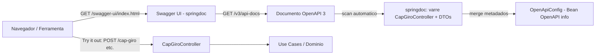

# Design — Configurar o Swagger (OpenAPI) do projeto

## Overview

Esta feature adiciona documentação interativa de API (OpenAPI 3 + Swagger UI) ao serviço **orch-poc**, servida pela própria aplicação Spring Boot na porta **8081**, sem serviço externo. A solução usa a biblioteca **springdoc-openapi**, que faz a varredura automática dos controllers Spring MVC e gera o documento OpenAPI e a interface Swagger UI em tempo de execução.

O que será adicionado:

1. **Dependência** `org.springdoc:springdoc-openapi-starter-webmvc-ui` na **linha 3.0.x** (compatível com Spring Boot 4 / Spring 7) no `pom.xml`.
2. **Classe de configuração** `com.bradesco.orch.config.OpenApiConfig` — um `@Configuration` com um `@Bean OpenAPI` que customiza a seção `info` (título, descrição, versão, contato).
3. **Anotações OpenAPI opcionais** (`@Tag`, `@Operation`, `@ApiResponse`, `@Schema`) apenas no `CapGiroController` e seus DTOs em `adapter/in/rest`, para enriquecer a documentação. Sem elas, o springdoc já documenta automaticamente.
4. **Propriedades externalizáveis** no `application.properties` para caminhos e habilitação por ambiente.

URLs resultantes (porta 8081), com os caminhos padrão:

| Recurso | URL |
|---|---|
| Swagger UI (redirect) | `http://localhost:8081/swagger-ui.html` |
| Swagger UI (página) | `http://localhost:8081/swagger-ui/index.html` |
| Documento OpenAPI (JSON) | `http://localhost:8081/v3/api-docs` |
| Documento OpenAPI (YAML) | `http://localhost:8081/v3/api-docs.yaml` |

> Atende ao **Requisito 1** (Swagger UI) e ao **Requisito 2** (documento JSON/YAML).

## Architecture

O springdoc opera na borda da aplicação: é um adapter de entrada de documentação. Toda a configuração e as anotações ficam confinadas às camadas de configuração e de adapter de entrada REST. **A camada de domínio (`com.bradesco.orch.domain`) permanece intacta e sem qualquer referência a springdoc/OpenAPI.**

Onde cada peça vive:

| Peça | Local | Papel |
|---|---|---|
| Dependência springdoc | `pom.xml` | Habilita geração automática do OpenAPI + Swagger UI |
| `OpenApiConfig` (`@Bean OpenAPI`) | `com.bradesco.orch.config` | Metadados institucionais (`info`) da API |
| `@Tag`/`@Operation`/`@ApiResponse` | `com.bradesco.orch.adapter.in.rest.CapGiroController` | Enriquecer descrição por endpoint (opcional) |
| `@Schema` | DTOs em `com.bradesco.orch.adapter.in.rest` | Descrição/exemplos de campos (opcional) |
| Propriedades springdoc | `src/main/resources/application.properties` | Caminhos e habilitação por ambiente |
| Domínio | `com.bradesco.orch.domain` | **Sem alterações** |

A classe de configuração fica em `com.bradesco.orch.config` (pacote de configuração/infra), atendendo ao **Requisito 7.3**: não introduz dependências de framework web no domínio e preserva a direção de dependências (adapters → domínio, nunca o contrário).

### Fluxo de request



O documento é montado a partir de duas fontes que o springdoc combina: (a) a varredura automática dos controllers/DTOs e (b) os metadados definidos no `@Bean OpenAPI`. As chamadas "Try it out" da Swagger UI atingem o `CapGiroController` real, que delega ao domínio — atendendo ao **Requisito 1.3**.

## Components and Interfaces

### 1. `pom.xml` — dependência springdoc (Requisito 5)

Adicionar ao bloco `<dependencies>`:

```xml
<dependency>
    <groupId>org.springdoc</groupId>
    <artifactId>springdoc-openapi-starter-webmvc-ui</artifactId>
    <version>3.0.3</version>
</dependency>
```

Racional de versão:

- **springdoc 3.0.x** é a linha compatível com **Spring Boot 4 / Spring 7**. É a versão usada pelo projeto de referência oficial `springdoc-openapi-versioning-demo` com Spring 7.
- **NÃO** usar springdoc `2.x` (destinado a Boot 3) nem `1.x` (Boot 2): sob Boot 4 essas versões não inicializam (risco de `NoSuchMethodError`/`ClassNotFoundException`).
- Como o parent é `spring-boot-starter-parent:4.0.9-SNAPSHOT`, a versão exata dentro da linha 3.0.x (`3.0.2` / `3.0.3`) pode precisar de pequeno ajuste conforme disponibilidade no repositório. O `pom.xml` já declara o repositório `spring-snapshots` (`https://repo.spring.io/snapshot`); caso o artefato do springdoc esteja em milestones, adicionar também `spring-milestones` (`https://repo.spring.io/milestone`).

> Atende ao **Requisito 5.1/5.2/5.4**.

### 2. `com.bradesco.orch.config.OpenApiConfig` (Requisitos 4 e 7)

Classe de configuração que define os metadados institucionais da API. Não referencia o domínio.

```java
package com.bradesco.orch.config;

import io.swagger.v3.oas.models.OpenAPI;
import io.swagger.v3.oas.models.info.Contact;
import io.swagger.v3.oas.models.info.Info;
import org.springframework.context.annotation.Bean;
import org.springframework.context.annotation.Configuration;

@Configuration
public class OpenApiConfig {

    @Bean
    public OpenAPI orchOpenApi() {
        return new OpenAPI()
                .info(new Info()
                        .title("orch-poc API")
                        .description("API de orquestracao de capital de giro (cap-giro). "
                                + "Inicia orquestracoes assincronas e consulta o estado/etapas.")
                        .version("v1")
                        .contact(new Contact()
                                .name("Time Orquestracao - Bradesco")
                                .email("time-orquestracao@bradesco.com.br")));
    }
}
```

Observações:

- Os metadados (`title`, `description`, `version`, `contact`) aparecem na seção `info` do documento e no topo da Swagger UI (**Requisito 4.1/4.2**).
- Se o bean não existisse, o springdoc aplicaria um `info` genérico e a inicialização não falharia; os valores acima são os padrões coerentes do projeto (**Requisito 4.3**).
- Alterar os metadados não exige mudança no domínio (**Requisito 4.4/7.3**).

### 3. `CapGiroController` — anotações opcionais (Requisito 3)

O springdoc **já documenta automaticamente** os três endpoints a partir dos mapeamentos Spring MVC e das assinaturas de método (**Requisito 3.5**: novos endpoints entram no documento sem configuração por endpoint). As anotações abaixo são **opcionais** e servem apenas para enriquecer descrições e explicitar respostas como o `404` (que não é inferível só pela assinatura).

Exemplo de enriquecimento (aplicado sobre o controller atual, sem alterar a lógica):

```java
@Tag(name = "Cap Giro", description = "Orquestracao de capital de giro")
@RestController
@RequestMapping("/cap-giro")
public class CapGiroController {

    @Operation(summary = "Inicia uma orquestracao (assincrona)")
    @ApiResponse(responseCode = "202", description = "Orquestracao aceita para processamento")
    @PostMapping
    public ResponseEntity<IniciarOrquestracaoResponse> iniciar(
            @RequestBody(required = false) IniciarOrquestracaoRequest request) { ... }

    @Operation(summary = "Consulta a orquestracao completa (dados + etapas)")
    @ApiResponse(responseCode = "200", description = "Orquestracao encontrada")
    @ApiResponse(responseCode = "404", description = "Orquestracao nao encontrada")
    @GetMapping("/{orquestracaoId}")
    public ResponseEntity<OrquestracaoResponse> consultar(@PathVariable String orquestracaoId) { ... }

    @Operation(summary = "Consulta apenas as etapas da orquestracao")
    @ApiResponse(responseCode = "200", description = "Etapas encontradas")
    @ApiResponse(responseCode = "404", description = "Orquestracao nao encontrada")
    @GetMapping("/{orquestracaoId}/etapas")
    public ResponseEntity<List<OrquestracaoResponse.EtapaResponseView>> consultarEtapas(
            @PathVariable String orquestracaoId) { ... }
}
```

Imports (do springdoc/swagger-core, disponíveis via starter):

```java
import io.swagger.v3.oas.annotations.Operation;
import io.swagger.v3.oas.annotations.responses.ApiResponse;
import io.swagger.v3.oas.annotations.tags.Tag;
```

Mapeamento endpoint → contrato documentado:

- `POST /cap-giro` → request opcional `IniciarOrquestracaoRequest { correlationId }`, resposta **202** com `IniciarOrquestracaoResponse { orquestracaoId }` (**Requisito 3.1**).
- `GET /cap-giro/{orquestracaoId}` → path param `orquestracaoId`, **200** `OrquestracaoResponse` (com lista de `EtapaResponseView`) ou **404** (**Requisito 3.2**).
- `GET /cap-giro/{orquestracaoId}/etapas` → path param `orquestracaoId`, **200** lista de `EtapaResponseView` ou **404** (**Requisito 3.3**).

### 4. DTOs — `@Schema` opcional (Requisito 3.4)

Os schemas são inferidos automaticamente dos records existentes, refletindo os campos reais e **sem expor as entidades de domínio** (os DTOs já fazem essa tradução — ex.: `OrquestracaoResponse.de(Orquestracao)`). O uso de `@Schema` é opcional, apenas para descrição/exemplos:

```java
public record IniciarOrquestracaoRequest(
        @Schema(description = "Identificador de correlacao (opcional; gerado se ausente)",
                example = "3fa85f64-5717-4562-b3fc-2c963f66afa6")
        String correlationId) { ... }

public record IniciarOrquestracaoResponse(
        @Schema(description = "Id da orquestracao criada")
        String orquestracaoId) { }
```

Campos reais que serão refletidos nos schemas (**Requisito 3.4**):

- `IniciarOrquestracaoRequest`: `correlationId`.
- `IniciarOrquestracaoResponse`: `orquestracaoId`.
- `OrquestracaoResponse`: `orquestracaoId`, `name`, `order`, `status`, `dataCriacao`, `dataAtualizacao`, `etapas`.
- `OrquestracaoResponse.EtapaResponseView`: `name`, `order`, `status`, `tentativasRealizadas`, `limiteRetentativas`, `callbackResponse`.

Import: `import io.swagger.v3.oas.annotations.media.Schema;`

## Configuration

Propriedades adicionadas ao `src/main/resources/application.properties`, externalizadas com o padrão `${VAR:default}` (**Requisito 6**):

```properties
# ==========================================================================
# OpenAPI / Swagger UI (springdoc)
# Caminhos e habilitacao externalizaveis por ambiente.
# ==========================================================================
# Caminho da UI do Swagger (default /swagger-ui.html)
springdoc.swagger-ui.path=${SWAGGER_UI_PATH:/swagger-ui.html}
# Caminho do documento OpenAPI JSON (default /v3/api-docs)
springdoc.api-docs.path=${API_DOCS_PATH:/v3/api-docs}
# Habilitacao da UI e do documento (default true; desabilite por ambiente)
springdoc.swagger-ui.enabled=${SWAGGER_UI_ENABLED:true}
springdoc.api-docs.enabled=${API_DOCS_ENABLED:true}
```

Comportamento:

- Sem nenhuma dessas propriedades, o springdoc usa os caminhos padrão `/swagger-ui.html` e `/v3/api-docs` (**Requisito 6.3**).
- Os caminhos são ajustáveis via properties ou variáveis de ambiente, sem recompilação (**Requisito 6.1**).
- Habilitação por ambiente: definir `SWAGGER_UI_ENABLED=false` / `API_DOCS_ENABLED=false` desliga a UI e/ou o documento naquele ambiente (**Requisito 6.2**).

Desabilitação por perfil (**Requisito 6.4**) — exemplo com `application-prod.properties`:

```properties
# application-prod.properties (ativado com spring.profiles.active=prod)
springdoc.swagger-ui.enabled=false
springdoc.api-docs.enabled=false
```

Assim, o mesmo artefato expõe a documentação em `dev` e a oculta em `prod` apenas trocando o perfil ativo, sem recompilar.

## Error Handling / Edge Cases

- **Quando desabilitado**: com `springdoc.swagger-ui.enabled=false`, a rota da UI passa a responder **404**; com `springdoc.api-docs.enabled=false`, `/v3/api-docs` responde **404**. Nenhum outro endpoint da aplicação é afetado.
- **Incompatibilidade de versão sob Boot 4**: se a versão escolhida da linha 3.0.x não subir (falha de contexto, `NoSuchMethodError`, `ClassNotFoundException`), a ação é **ajustar a versão dentro da própria linha 3.0.x** (alternar entre `3.0.3` e `3.0.2`) e garantir que os repositórios `spring-snapshots`/`spring-milestones` estejam habilitados para resolver artefatos alinhados ao Boot 4 SNAPSHOT (**Requisito 5.4**). Não regredir para 2.x/1.x.
- **Segurança / CSP**: o projeto **não possui Spring Security**, portanto não há filtros de autenticação nem política de CSP bloqueando a Swagger UI ou o `/v3/api-docs`. Nenhuma regra de `permitAll`/CSP precisa ser adicionada. Caso Spring Security seja introduzido futuramente, será necessário liberar as rotas `/swagger-ui/**`, `/swagger-ui.html`, `/v3/api-docs/**` e ajustar CSP.
- **404 nas consultas**: o comportamento **404** já existente do `CapGiroController` (orquestração inexistente) é documentado via `@ApiResponse`, mas não altera a lógica atual.

## Testing Strategy

1. **Teste de fumaça do documento OpenAPI** (`@SpringBootTest` + `MockMvc`):
   - `GET /v3/api-docs` retorna **200**.
   - O corpo contém os paths `/cap-giro`, `/cap-giro/{orquestracaoId}` e `/cap-giro/{orquestracaoId}/etapas` (**Requisitos 2 e 3**).

   ```java
   @SpringBootTest
   @AutoConfigureMockMvc
   class OpenApiDocsSmokeTest {

       @Autowired MockMvc mockMvc;

       @Test
       void apiDocsExposeCapGiroPaths() throws Exception {
           mockMvc.perform(get("/v3/api-docs"))
                   .andExpect(status().isOk())
                   .andExpect(jsonPath("$.paths['/cap-giro']").exists())
                   .andExpect(jsonPath("$.paths['/cap-giro/{orquestracaoId}']").exists());
       }
   }
   ```

2. **Subida de contexto**: garantir que o contexto Spring inicializa com a dependência springdoc presente (validado implicitamente por qualquer `@SpringBootTest` — cobre o **Requisito 5.2/5.3**). Como o contexto depende de MongoDB/Service Bus, o teste deve usar os defaults/emulador locais ou mocks para os ports, evitando conexões externas reais.

3. **(Opcional) Teste do bean OpenAPI**: verificar que o `@Bean OpenAPI` expõe `info().getTitle()` igual a `"orch-poc API"` e o contato configurado (**Requisito 4**).

## Preservação da Arquitetura Hexagonal (Requisito 7)

- O pacote `com.bradesco.orch.domain` **não recebe** nenhuma dependência nem anotação do springdoc/OpenAPI (**Requisito 7.1**).
- Todas as anotações OpenAPI (`@Tag`, `@Operation`, `@ApiResponse`, `@Schema`) ficam **exclusivamente** em `com.bradesco.orch.adapter.in.rest` (controller e DTOs) (**Requisito 7.2**).
- A configuração de metadados reside em `com.bradesco.orch.config`, sem trazer framework web para o domínio (**Requisito 7.3**).
- A direção de dependências é preservada: os adapters e a config dependem do domínio; o domínio não conhece springdoc nem os adapters (**Requisito 7.4**).

## Rastreabilidade Requisitos → Design

| Requisito | Onde é atendido |
|---|---|
| 1 — Swagger UI no navegador | Overview (URLs), dependência starter-webmvc-ui, fluxo Mermaid, "Try it out" atinge o controller real |
| 2 — Documento OpenAPI JSON/YAML | Overview (`/v3/api-docs`, `/v3/api-docs.yaml`), varredura automática, teste de fumaça |
| 3 — Documentar CapGiroController | Components §3 (anotações opcionais + doc automática) e §4 (DTOs/schemas) |
| 4 — Metadados configuráveis | Components §2 (`OpenApiConfig` com `info`/`contact`), teste opcional do bean |
| 5 — Compatibilidade Boot 4 / Spring 7 | Components §1 (springdoc 3.0.x, repositórios), Error Handling (ajuste de versão) |
| 6 — Configuração externalizável por ambiente | Configuration (properties `${VAR:default}`, perfil `prod`) |
| 7 — Preservar hexagonal e domínio | Architecture (tabela de localização) e seção "Preservação da Arquitetura Hexagonal" |
